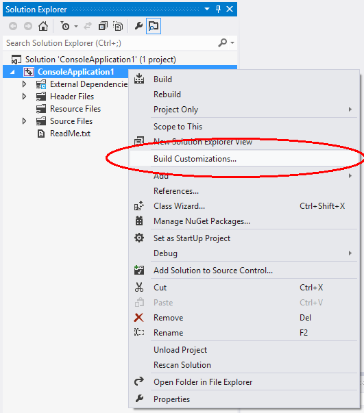
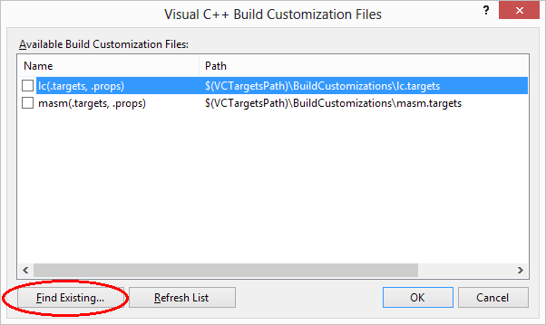
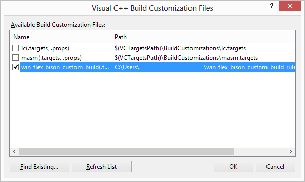
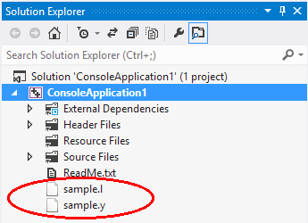
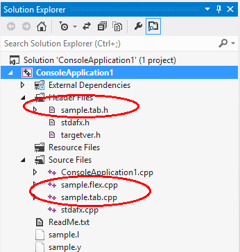
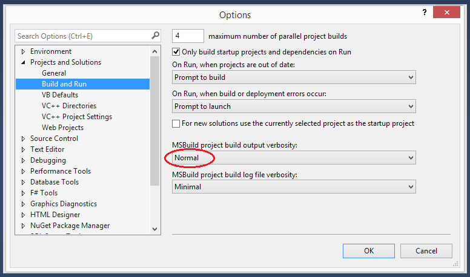
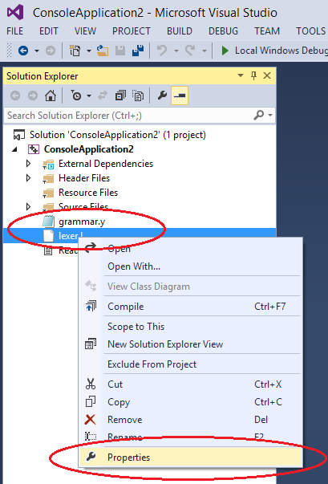
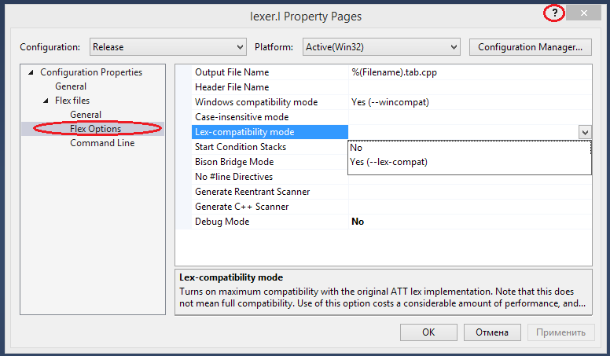
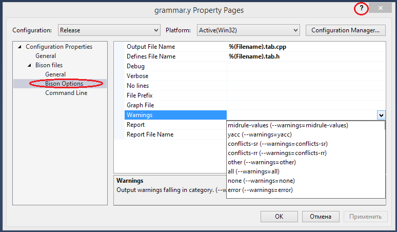
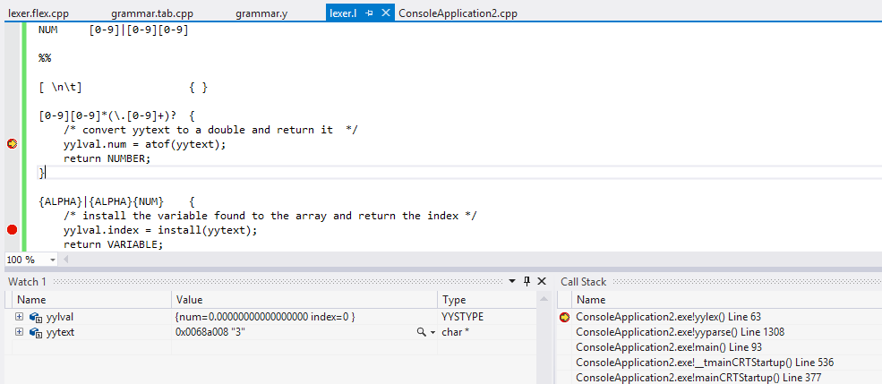

How to setup custom build rules for Visual Studio 2010 and up.
---------------

First of all you should have the necessary files.
Custom Build rules are separated into a file triplet of `.xml`, `.targets` and `.props`.

You find the custom build rules for win_flex_bison in the **custom_build_rules** directory of the win_flex_bison archive.

You may choose to install one of the following rule set

* the combined rules - [alternative download][1]:
    * [win_flex_bison_custom_build.props  ](win_flex_bison/win_flex_bison_custom_build.props)
    * [win_flex_bison_custom_build.targets](win_flex_bison/win_flex_bison_custom_build.targets)
    * [win_flex_bison_custom_build.xml    ](win_flex_bison/win_flex_bison_custom_build.xml)

* flex only rules   - [alternative download][2]:
    * [win_flex_custom_build.props](win_flex_only/win_flex_custom_build.props)
    * [win_flex_custom_build.targets](win_flex_only/win_flex_custom_build.targets)
    * [win_flex_custom_build.xml](win_flex_only/win_flex_custom_build.xml)

* bison only rules  - [alternative download][3]:
    * [win_bison_custom_build.props](win_bison_only/win_bison_custom_build.props)
    * [win_bison_custom_build.targets](win_bison_only/win_bison_custom_build.targets)
    * [win_bison_custom_build.xml](win_bison_only/win_bison_custom_build.xml)

This documentation uses the combined rule-set but can be used for all rule-sets.

[1]: https://sourceforge.net/projects/winflexbison/files/win_flex_bison_custom_build_rules.zip/download "Combined build rules for Bison and Flex"
[2]: https://sourceforge.net/projects/winflexbison/files/win_flex_custom_build_rules.zip/download "Build rules for Flex only"
[3]: https://sourceforge.net/projects/winflexbison/files/win_bison_custom_build_rules.zip/download "Build rules for Bison only"

----

Launch Visual Studio and open an VC++ project.
Open context menu for project item in Solution Explorer panel and select "**Build Customizations...**" menu item.

----

In popup dialog "Visual C++ Build Customization Files" press "**Find Existing...**" button.

----

In Open File dialog select "**win_flex_bison_custom_build.targets**" file and press "Open".

----

You will see "Add Search Path?" message box, press "Yes".

----

In "Visual C++ Build Customization Files" dialog check just added item **win_flex_bison_custom_build** and press "OK".

----

Now you can add flex and bison files to the project...

... and build.
In build output you should see something like this:

~~~~

1>------ Rebuild All started: Project: ConsoleApplication1, Configuration: Debug Win32 ------
1>  Process sample bison file
1>  Process sample flex file
1>  stdafx.cpp
1>  ConsoleApplication1.cpp
1>  Generating Code...
1>  ConsoleApplication1.vcxproj -> C:\Users\ConsoleApplication1\Debug\ConsoleApplication1.exe
========== Rebuild All: 1 succeeded, 0 failed, 0 skipped ==========

~~~~

-----

For **sample.y** bison file there are two output files: **sample.tab.h** and **sample.tab.cpp**.
For **sample.l** flex file you'll got **sample.flex.cpp**.

Now you can add them to the project and build. (*Don't forget to exclude cpp files from using precompiled headers*)

~~~~

1>------ Build started: Project: ConsoleApplication1, Configuration: Debug Win32 ------
1>  Process sample bison file
1>  Process sample flex file
1>  sample.tab.cpp
1>  sample.flex.cpp
1>  Generating Code...
1>  ConsoleApplication1.vcxproj -> C:\Users\ConsoleApplication1\Debug\ConsoleApplication1.exe
========== Build: 1 succeeded, 0 failed, 0 up-to-date, 0 skipped ==========

~~~~

----

If your flex/bison file is incorrect and you've got an error. But you don't see actual error message, something like this:

~~~~

1>------ Build started: Project: ConsoleApplication2, Configuration: Debug Win32 ------
1>  Process "grammar.y" bison file
1>C:...\custom_build_rules\win_flex_bison_custom_build.targets(55,5): error MSB3721: The command "
1>C:...\custom_build_rules\win_flex_bison_custom_build.targets(55,5): error MSB3721: start /B /WAIT /D "C:...\ConsoleApplication2\ConsoleApplication2\" win_bison.exe --output="grammar.tab.cpp" --defines="grammar.tab.h" --graph="1.dot" "grammar.y"
1>C:...\custom_build_rules\win_flex_bison_custom_build.targets(55,5): error MSB3721: exit /b %errorlevel%" exited with code 1.
========== Build: 0 succeeded, 1 failed, 0 up-to-date, 0 skipped ==========

~~~~

You can change Build Output Verbosity from "Minimal" to "Normal" in "Options" dialog

Then you will see more detailed output:

~~~~

1>BisonTarget:
1>  Process "grammar.y" bison file
1>  grammar.y:51.1-4: error: invalid directive: '%sdw'
1>C:...\custom_build_rules\win_flex_bison_custom_build.targets(55,5): error MSB3721: The command "
1>C:...\custom_build_rules\win_flex_bison_custom_build.targets(55,5): error MSB3721: start /B /WAIT /D "C:...\ConsoleApplication2\" win_bison.exe --output="grammar.tab.cpp" --defines="grammar.tab.h" --graph="1.dot" "grammar.y"
1>C:...\custom_build_rules\win_flex_bison_custom_build.targets(55,5): error MSB3721: exit /b %errorlevel%" exited with code 1.
1>
1>Build FAILED.
1>
1>Time Elapsed 00:00:01.21
========== Build: 0 succeeded, 1 failed, 0 up-to-date, 0 skipped ==========

~~~~

----

Also you can tune some flex/bison options in files properties dialog:

----

To debug your scanner or parser you can set break points right into **sample.y** or **sample.l** code.

----

To use the Visual C++ Code editor for Flex/Bison files instead of the text editor adjust your editor settings as follows:

* click **Options** on the **Tools** menu, expand the **Text Editor** node and select **File Extension**
* type extension **`l`** in the **Extension** field and choose **Microsoft Visual C++** in the **Editor** drop-down field, click **Add**
* do the same for the extension **`y`**

You now have syntax highlighting, code-completion and show definition options in your Flex/Bison source.

----

Enjoy!
